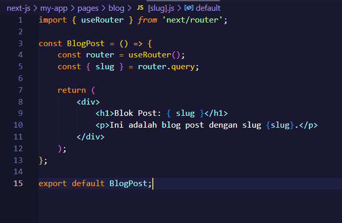
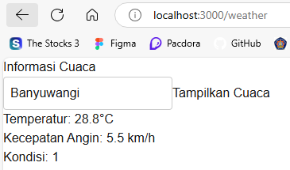

This is a [Next.js](https://nextjs.org) project bootstrapped with [`create-next-app`](https://nextjs.org/docs/pages/api-reference/create-next-app).

## Getting Started

First, run the development server:

```bash
npm run dev
# or
yarn dev
# or
pnpm dev
# or
bun dev
```

Open [http://localhost:3000](http://localhost:3000) with your browser to see the result.

You can start editing the page by modifying `pages/index.tsx`. The page auto-updates as you edit the file.

[API routes](https://nextjs.org/docs/pages/building-your-application/routing/api-routes) can be accessed on [http://localhost:3000/api/hello](http://localhost:3000/api/hello). This endpoint can be edited in `pages/api/hello.ts`.

The `pages/api` directory is mapped to `/api/*`. Files in this directory are treated as [API routes](https://nextjs.org/docs/pages/building-your-application/routing/api-routes) instead of React pages.

This project uses [`next/font`](https://nextjs.org/docs/pages/building-your-application/optimizing/fonts) to automatically optimize and load [Geist](https://vercel.com/font), a new font family for Vercel.

## Learn More

To learn more about Next.js, take a look at the following resources:

- [Next.js Documentation](https://nextjs.org/docs) - learn about Next.js features and API.
- [Learn Next.js](https://nextjs.org/learn-pages-router) - an interactive Next.js tutorial.

You can check out [the Next.js GitHub repository](https://github.com/vercel/next.js) - your feedback and contributions are welcome!

## Deploy on Vercel

The easiest way to deploy your Next.js app is to use the [Vercel Platform](https://vercel.com/new?utm_medium=default-template&filter=next.js&utm_source=create-next-app&utm_campaign=create-next-app-readme) from the creators of Next.js.

Check out our [Next.js deployment documentation](https://nextjs.org/docs/pages/building-your-application/deploying) for more details.


## Laporan Praktikum

|  | Pemrograman Berbasis Framework 2024 |
|--|--|
| NIM |  2241720089 |
| Nama |  Putra Nindya Yuwana |
| Kelas | TI - 3C |


### Praktikum 1: Menyiapkan Lingkungan

1. Pastikan Node.js dan npm sudah terinstal di komputer	


2. Buat direktori baru untuk proyek Next.js	 


3. Inisialisasi proyek Next.js	 


4. Jalankan aplikasi Next.js


	 

### Praktikum 2: Membuat Halaman dengan Server-Side Rendering (SSR)

1. Buka file pages/index.tsx


2. Ganti kode di dalamnya dengan kode berikut untuk membuat halaman sederhana:	 


3. Simpan file dan lihat perubahan di browser. Anda akan melihat halaman utama dengan teks "Selamat Datang di Website Saya!"	 


### Praktikum 3: Menggunakan Static Site Generation (SSG)

1. Buat file baru di direktori pages dengan nama blog.js.


2. Tambahkan kode berikut untuk membuat halaman blog dengan SSG:	 


3. Simpan file dan buka http://localhost:3000/blog di browser. Anda akan melihat daftar post yang diambil dari API eksternal.	 


### Praktikum 4: Menggunakan Dynamic Routes

1. Buat direktori baru di pages dengan nama blog.	


2. Buat file di dalam direktori blog dengan nama [slug].js	 


3. Tambahkan kode berikut untuk membuat halaman dinamis berdasarkan slug:	 



4. Simpan file dan buka http://localhost:3000/blog/contoh-post di browser. Anda akan melihat halaman yang menampilkan slug dari URL.	 


### Praktikum 5: Menggunakan API Routes

1. Pastikan terdapat direktori di pages dengan nama api.	


2. Buat file di dalam direktori api dengan nama products.js	 


3. Tambahkan kode berikut untuk membuat API route yang mengembalikan daftar produk:	 


4. Buat file baru di pages dengan nama products.js untuk menampilkan daftar produk:	 


5. Simpan file dan buka http://localhost:3000/products di browser. Anda akan melihat daftar produk yang diambil dari API route.	 


### Praktikum 6: Menggunakan Link Component

1. Buka file pages/index.tsx dan tambahkan modif dengan kode berikut untuk membuat link ke halaman lain	


2. Buat file baru di pages dengan nama about.js untuk halaman "Tentang Kami":	 


3. Simpan file dan buka http://localhost:3000 di browser. Klik link "Tentang Kami" untuk navigasi ke halaman tentang.	  


### Tugas

1. Buat halaman baru dengan menggunakan Static Site Generation (SSG) yang menampilkan daftar pengguna dari API https://jsonplaceholder.typicode.com/users.	 
2. Implementasikan Dynamic Routes untuk menampilkan detail pengguna berdasarkan ID.	
3. Buat API route yang mengembalikan data cuaca dari API eksternal (misalnya, OpenWeatherMap) dan tampilkan data tersebut di halaman front-end.	

#### Code


#### Output


